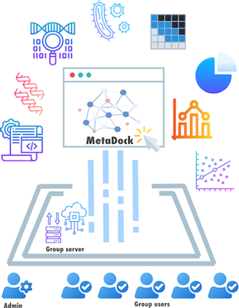

# MetaDock: A browser-based platform for running metagenomic tools on server systems

## Introduction
Microbiome research increasingly relies on computational tools that require HPC access and programming skills, posing challenges for many scientists and clinicians. While web platforms like Galaxy exist, transferring large metagenomic datasets—especially sensitive clinical data—is often restricted by data protection laws. Local installation alternatives, meanwhile, demand technical expertise. To address this, we present MetaDock: a browser-based platform that lets non-programmers run popular metagenomic tools directly on institutional server systems. Designed for installation by a single bioinformatician, MetaDock provides two interfaces: an admin panel for easy tool setup and management, and a user-friendly GUI for running analyses via point-and-click, without coding.

## Manual for admin 

- [Installation](./docs/installation.md)
- [Brower initialization]()
- [Tool creation]()
- [Configuration]()
- [Management]()
- [Access distribution]()

## Manual for regular users

- [Login]()
- [Tool selection]()
- [Tool execution]()
- [Input data selction]()
- [Output data inspection]()