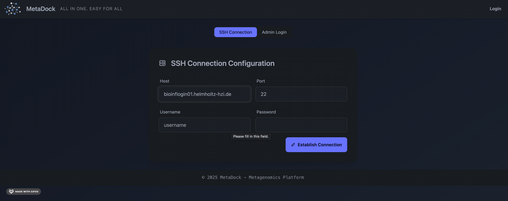

# MetaDock: Browser-Based Metagenomic Analysis on Institutional Servers

## Introduction

Microbiome research increasingly depends on computational tools that often require high-performance computing (HPC) resources and programming expertise. Existing web platforms like Galaxy are helpful, but transferring large or sensitive clinical datasets is frequently limited by data protection regulations. Local installations, on the other hand, can be technically challenging for many users.

**MetaDock** addresses these challenges by providing a browser-based platform that enables non-programmers to run popular metagenomic tools directly on institutional servers. Designed for easy deployment by a single bioinformatician, MetaDock features:

- **Admin Panel:** Simplifies tool setup, configuration, and management.
- **User-Friendly GUI:** Allows point-and-click analysis without coding.
   
## Roles in MetaDock

### Admin

Admins are responsible for installing, configuring, and maintaining the MetaDock platform. They should be familiar with UNIX systems and command-line bioinformatics tools. The admin bridges the backend (institutional server hosting data and tools) and the frontend (MetaDock's browser interface), empowering non-programmers to perform metagenomic analyses using institutional resources.

### Regular User

Regular users are typically biologists or clinicians with limited computational experience who need to analyze metagenomic data. MetaDock enables them to perform complex analyses through an intuitive graphical interface.

## For Admins

- [Installation Guide](./docs/installation.md)
- [Tool Creation](./docs/tool_creation.md)
- [Configuration](./docs/tool_configuration.md)

## For Regular Users

- [How to Log In]()
- [Selecting Tools]()
- [Running Analyses]()
