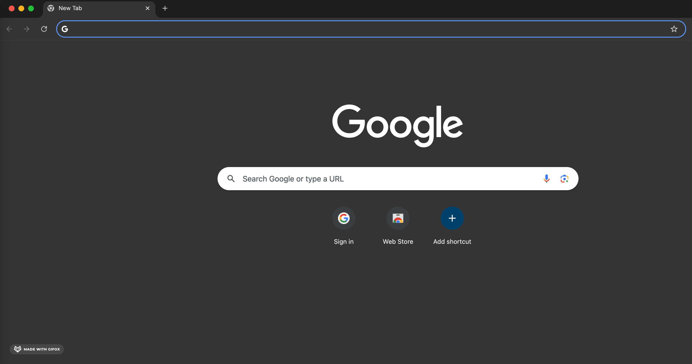

## Prerequisites: JavaScript (Node.js)

MetaDock is built using JavaScript and requires [Node.js](https://nodejs.org/) to run. To verify if Node.js is installed on your system, run:

```bash
node -v
```

If Node.js is not installed, you can set up an isolated Conda environment named `metadock` with Node.js:

1. **Create a new Conda environment with Node.js**  
    (Replace `nodejs=22` with your preferred version if needed):

    ```bash
    conda create -n metadock nodejs=22
    ```

2. **Activate the environment:**

    ```bash
    conda activate metadock
    ```

3. **Verify Node.js and npm installation:**

    ```bash
    node -v
    npm -v
    ```

---

## Installing MetaDock

1. **Clone the MetaDock repository:**

    ```bash
    git clone git@github.com:MetaDock/MetaDock_dv.git
    ```

2. **Navigate to the project directory:**

    ```bash
    cd MetaDock_dv
    ```

3. **Activate the `metadock` environment:**

    ```bash
    conda activate metadock
    ```

4. **Install dependencies:**

    ```bash
    npm install
    ```

5. **Start the MetaDock server:**

    ```bash
    node server.js
    ```

   After starting the server, you should see a message similar to:

   ```bash
   Server running on http://localhost:3010
   ```
6. **Create a local port:**
    
    ```bash
    ssh -L 3010:localhost:3010 your_account@server_domain
    ```
    As the MetaDock application is running on port of 3010 of your remote server, and it is only accessible from `localhost`, you need to use SSH to create a local port forwarding tunnel between the local machine and a remote server under a specific user account. 


7. **Access brower**
Open your browser and navigate to [http://localhost:3010](http://localhost:3010) to access MetaDock.

   


