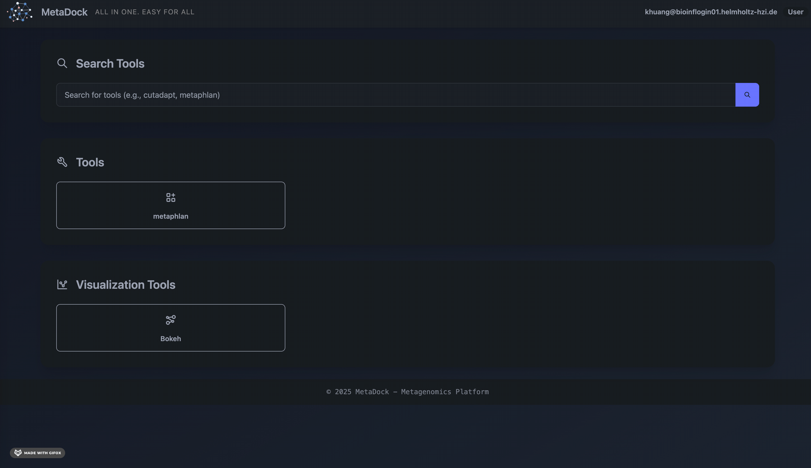
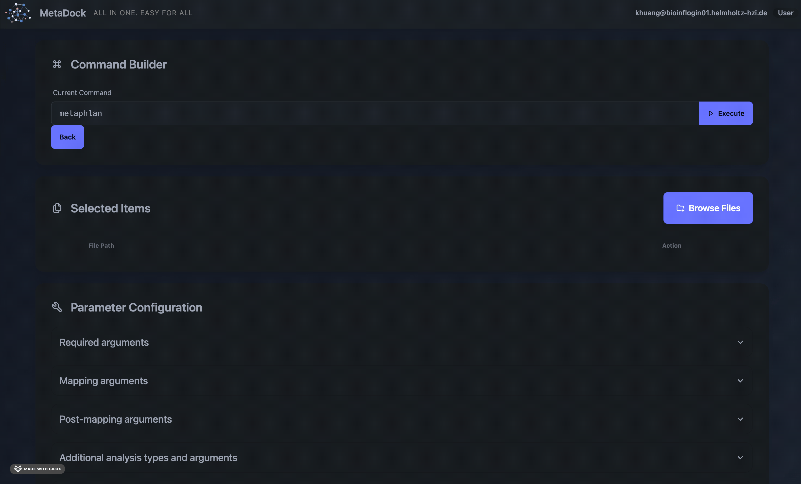
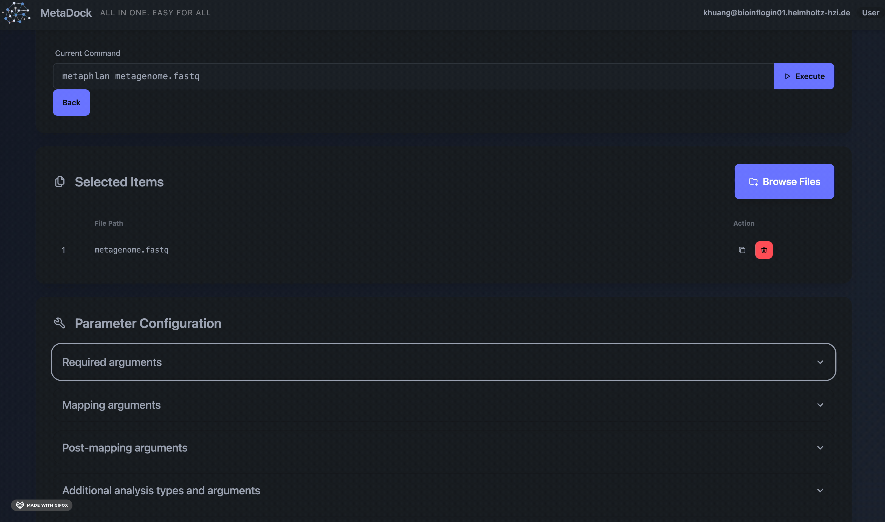
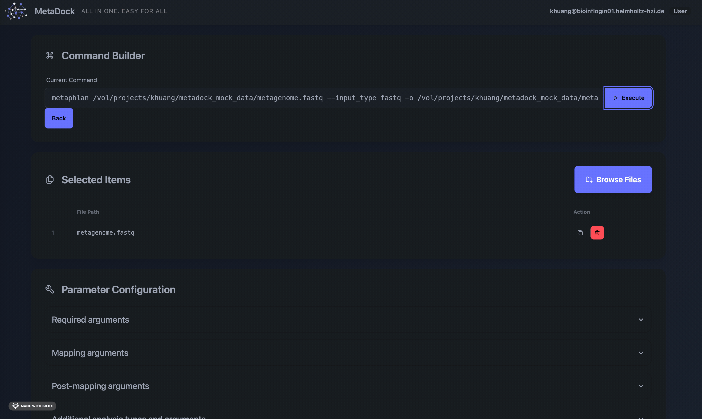

## Logging In with Your Credentials

1. **Obtain Your Credentials:**  
    MetaDock is an interface built on your group server. As a regular user, you must first obtain your account and password from the server administrator.

2. **Create a Local Port:**  
    With your credentials, set up a local port to access MetaDock through your browser. This step requires the command-line interface.

    Open your terminal and run:
    ```bash
    ssh -L 3010:localhost:3010 your_account@server_domain
    ```
    Enter your password when prompted.

3. **Access MetaDock in Your Browser:**  
    Open your browser and go to [http://localhost:3010](http://localhost:3010) to access the MetaDock interface.

    

---

## Running Your Analysis with Just a Few Clicks

1. **Select a Tool:**  
    Use the search bar or dashboard to find the tool you need. If a tool is missing, contact the admin to request its installation.  
    

2. **Choose Input Data:**  
    Select your input files using the "Browse Files" option. If your data is not on the server, use "Upload Files" to transfer files from your local PC.  
    

3. **Set Parameters:**  
    Adjust the analysis parameters as needed.  
    

4. **Run the Analysis:**  
    After setting parameters, the full command will appear in the "Current Command" box, and the tool's status will be shown in the "Execution Results" section.  
    

    Once execution is complete, you can download results from the output folder or start another analysis.
