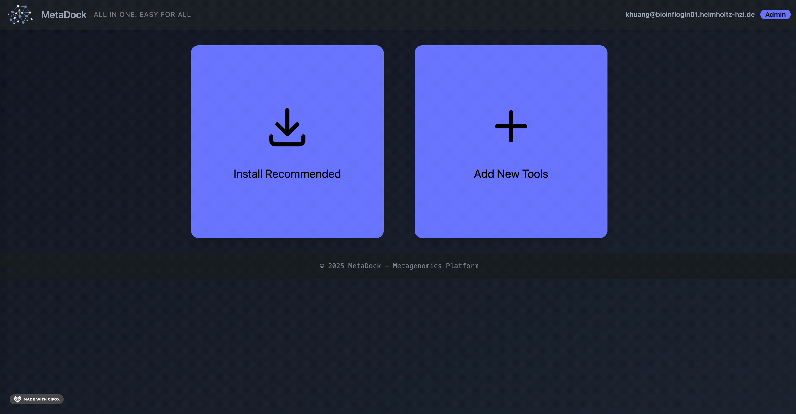
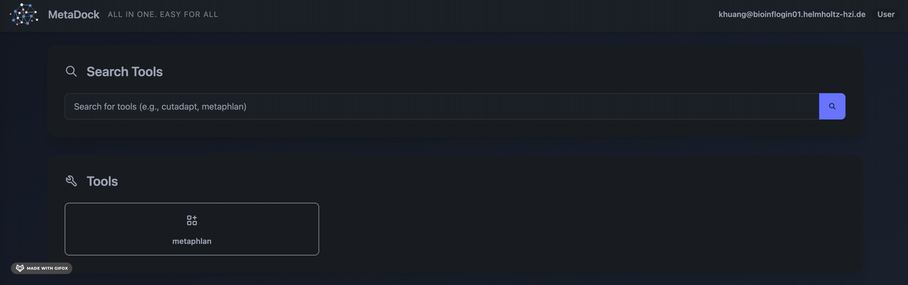

## Configuring Tools in the MetaDock Frontend

To enable regular users to run tools through MetaDock, an administrator must first set up a user-friendly parameter selection interface. MetaDock can automatically convert a CLI help page into a graphical interface.

### Steps

1. **Log in as an Administrator**  
    Log in with administrator privileges. To configure and manage the graphical interface for tool parameters, click **Add New Tools**:  
    

2. **Generate a Help Page as Plain Text**  
    Generate a help page from the tool's CLI and save it as a plain text file. For example, to generate a help page for [MetaPhlAn](https://github.com/biobakery/MetaPhlAn):  
    ```bash
    metaphlan -h > metaphlan_v4.1.1_help.txt
    ```
    > **Tip:** For better conversion, consider removing explanatory text from the help file, keeping only the argument definitions.

3. **Upload the Help Page to Generate the Graphical Interface**  
    Upload the help page file to MetaDock to automatically generate the tool's graphical interface:  
    

4. **Register the Tool in MetaDock**  
    Edit the `config/tools.js` file and add a new entry for your tool in the `"env"` section. Use the following template:
    ```json
    "metaphlan": {
      // ... other configuration fields ...
      "env": "bash -l -c \"source ${CONDA_PREFIX}/etc/profile.d/conda.sh; conda activate ${ENV_NAME}; __COMMAND__\""
      // ... other configuration fields ...
    }
    ```
    - Replace `${ENV_NAME}` with the environment name you created during [Tool Creation](../docs/tool_creation.md).
    - Other fields can remain unchanged unless you require custom configuration.

    To locate `${CONDA_PREFIX}/etc/profile.d/conda.sh`, run:
    ```bash
    ls $(conda info --base)/etc/profile.d/conda.sh
    ```

5. **Test the Tool**  
    Log in as a regular user and select the tool you just created:  
    

    Check the `help` parameter box:  
    

    You should see the results immediately:  
    

Congratulations! From this point forward, regular users without coding experience can easily run the tool you configured. You can repeat these steps to add more tools and further enhance your MetaDock environment.

