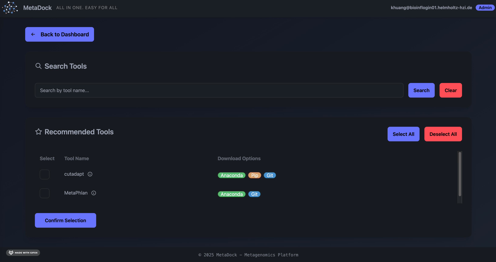
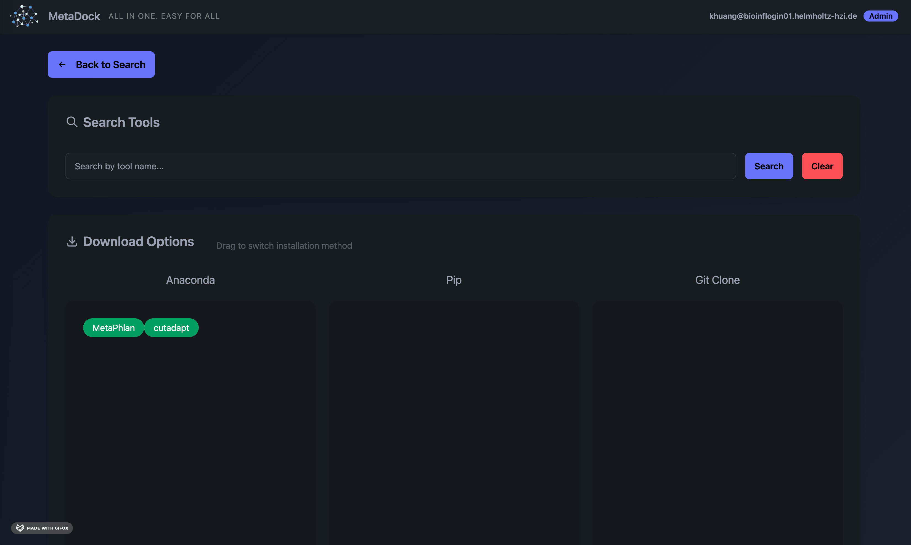
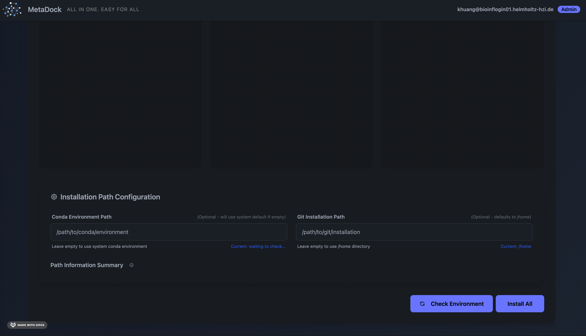

## Tool Creation on the Backend (Institutional Server)

To enable MetaDock to perform computational tasks using server resources, an administrator must first install the relevant CLI tools that align with the group's research interests. MetaDock supports two approaches for tool setup: manual creation and one-click creation.

### Manual Creation

Managing tools with [conda](https://anaconda.org/) environments is common in bioinformatics. As a demonstration examle, below is a step-by-step guide to integrating [MetaPhlAn 4.1.1](https://anaconda.org/bioconda/metaphlan/files?type=&version=4.1.1) into the MetaDock framework using conda:

1. **Check Tool Availability**
    ```bash
    conda search -c bioconda metaphlan --info | grep "4.1.1"
    ```
    Example output:
    ```bash
    metaphlan 4.1.1 pyhdfd78af_0
    file name   : metaphlan-4.1.1-pyhdfd78af_0.tar.bz2
    version     : 4.1.1
    url         : https://conda.anaconda.org/bioconda/noarch/metaphlan-4.1.1-pyhdfd78af_0.tar.bz2
    ```

2. **Create an Isolated Environment and Install the Tool**
    ```bash
    # --solver=libmamba significantly speeds up installation
    conda create -n metaphlan-4.1.1 \
      -c bioconda -c conda-forge \
      metaphlan=4.1.1 \
      --solver=libmamba -y
    ```

3. **Activate the Environment and Verify Installation**
    ```bash
    conda activate metaphlan-4.1.1
    metaphlan --version | grep "4.1.1"
    ```

4. **Register the Tool in MetaDock**
    Edit `config/tools.js` and add a new entry in the `"env"` section for the tool's environment. Use the following template:
    ```json
    "metaphlan-4.1.1": {
      // ... other configuration fields ...
      "env": "bash -l -c \"source ${CONDA_PREFIX}/etc/profile.d/conda.sh; conda activate metaphlan-4.1.1; __COMMAND__\""
      // ... other configuration fields ...
    }
    ```
    Other fields can be left as empty strings (`""`) as placeholders for now.

    To locate your `${CONDA_PREFIX}/etc/profile.d/conda.sh`:
    ```bash
    ls $(conda info --base)/etc/profile.d/conda.sh
    ```

### One-Click Creation

MetaDock also provides automated solution for installing tools we curated and included in this framework.

1. **Login as admin**

   

2. **Choose your tools**
   
   

3. **Choose installation environment**

   

4. **Start installation**
   
